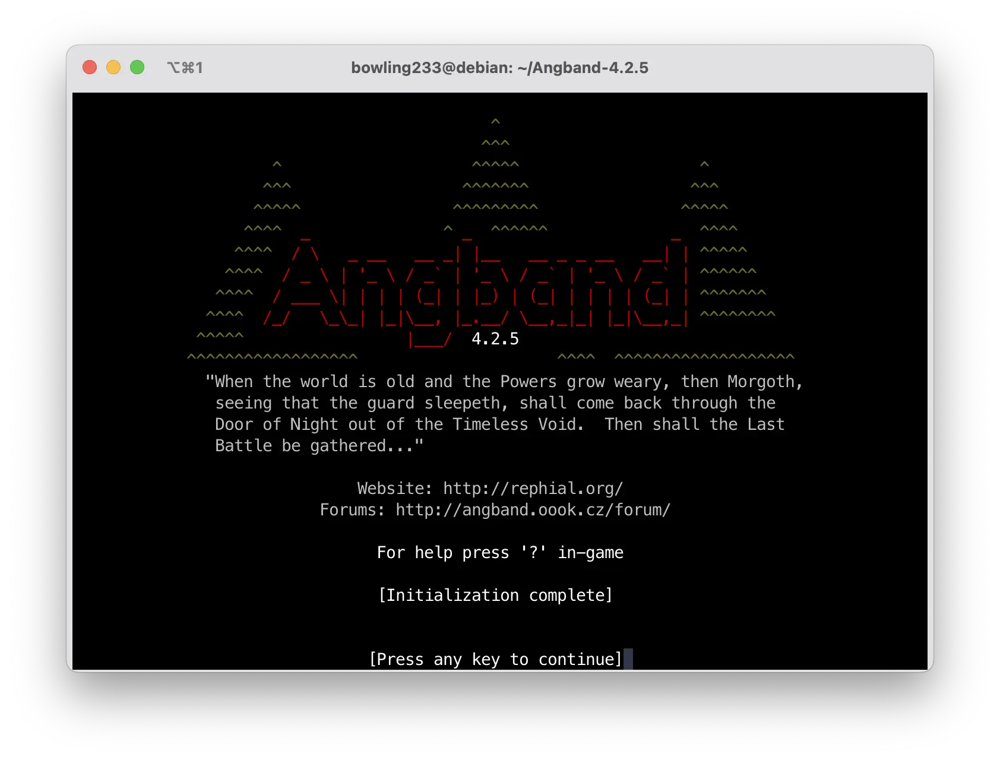
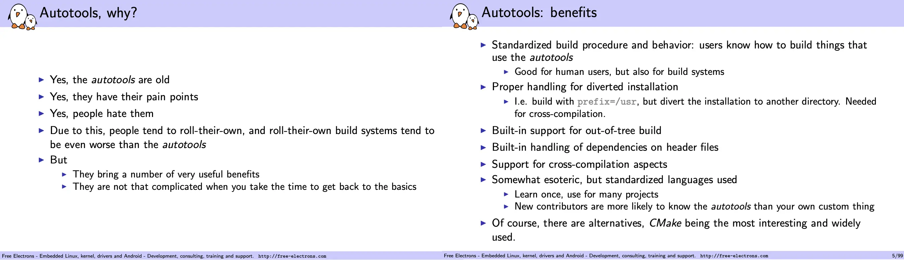
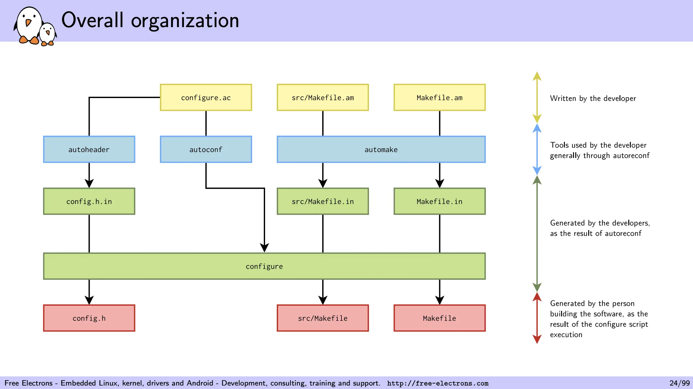
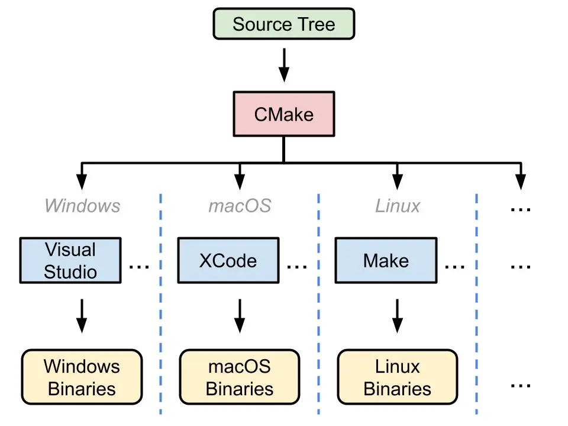
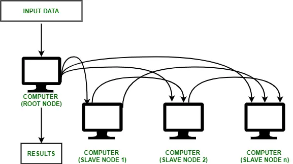
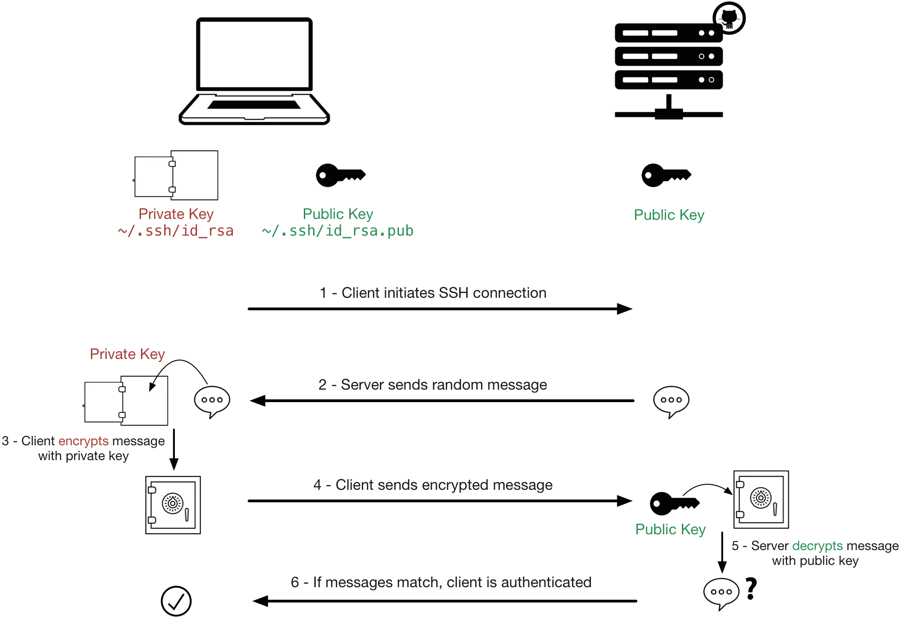
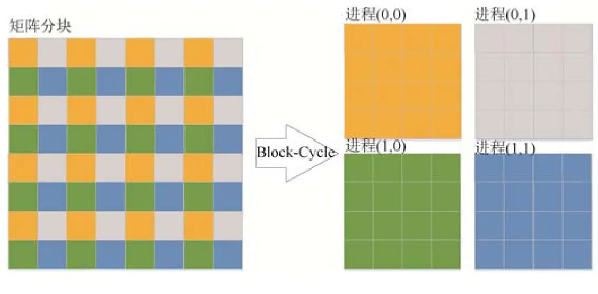
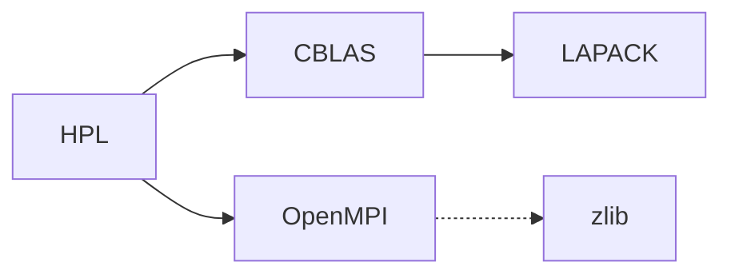
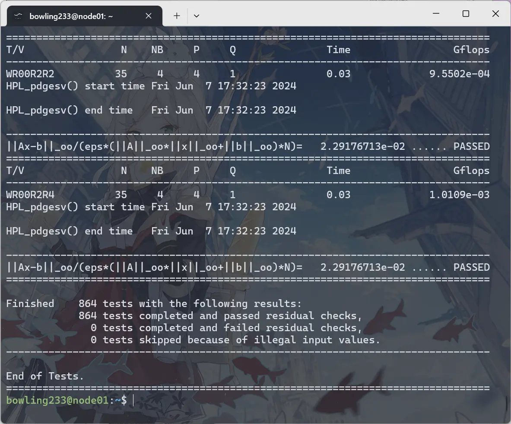

# 实验一：简单集群搭建

!!! tip "QC PASS"

    本实验流程已经通过检查，请放心食用。

    负责助教：郝星星 @mrhaoxx

## 导言：计算机集群

在 Lab 0 中，我们已经获得了 Linux 虚拟机环境，熟悉了 Linux 命令行的基本操作，对 Linux 系统的文件路径、用户权限、环境变量等基本概念有了一定的了解。在接下来的实验中，这些基础知识将会被广泛应用。

本次实验或许是你第一次接触到计算机集群。所谓计算机集群，就是将多台计算机连接在一起，通过网络协同工作，以完成一些大规模的计算任务。为什么我们需要计算机集群呢？因为单体的制造成本和性能是有限的。制造芯片时，人们想把单个处理器的性能提升到极致，但是遇到了物理限制：一块集成电路上的晶体管数量越多，设计就越复杂，发热就越严重，功耗就越大，性能就越低。因此，人们开始尝试将多个处理器连接在一起，就有了现代多核处理器。制造计算机时，也可以放置多个 CPU（常见的服务器一般都具有两颗），但放置更多只会增加单台计算机的设计和制造难度。与其想着怎么把单体造强，不如想着怎么把多个单体连接在一起，怎么让它们协同工作，这就是并行计算思想的由来。

## 实验内容和要求

本次实验，我们将使用四台Linux节点搭建一个简易的集群，并对该集群进行性能测试，最后提交测试结果和实验报告。

!!! tip "如何食用本 Lab"

    本 Lab 有 **知识讲解** 和 **任务** 两部分，其中 **知识讲解** 不需要体现在报告中。

    - 本次实验对基础知识介绍得比较详细，其中蓝色框框是希望你 take home 的知识点，请确保理解。
    - 任务部分需要自行完成，请遵守诚信守则。
    - 和 Lab 0 一样，如果你对这些内容轻车熟路，就不需要阅读知识讲解，直接完成任务即可。

### 提交内容

总的来说，你需要先阅读 **知识讲解** 部分，然后逐个完成 **任务** 部分，并将自己完成的过程记录在实验报告中。你需要提交以下的内容：

1. 使用中文完成的实验报告 PDF 文件，内容至少包括下面的过程:
    - 软件安装：下载 OpenMPI、BLAS 和 HPL 的源代码并编译安装。
    - 集群搭建：使用虚拟机 / Docker 容器 / 或者你喜欢的其他方式构建集群，配置节点间互联、测试节点间通信。
    - 性能测试：在虚拟机集群上使用 OpenMPI 运行 HPL 性能测试，记录测试结果。
2. HPL 输出结果文本文件
3. 如果修改了代码，请提交修改后的代码和一份修改说明。

如果有其他较长的纯文本形式的代码或者配置文件，无需包含在实验报告正文中，可以和 HPL 结果文件一样，作为附件提交。

!!! tip "如何写一份好的实验报告"

    1. 包含以下基本内容：
        - 实验环境：软硬件的细微差别也有可能导致实验过程和结果产生较大差异，因此记录实验环境是非常重要的。这包括宿主机硬件情况，操作系统版本，所使用的 Hypervisor 种类，虚拟机的硬件配置以及网络配置。
        - 实验过程：实验手册已经给出了详细步骤，因此这一部分你不需要再赘述，只需要给出关键截图证明你按步骤完成了即可。我们希望看到的是你在实验过程中遇到了哪些问题，以及你是如何解决的。
        - 实验结果及分析：对于希望你照做的实验（比如本次实验），本就有一个标准的结果，不需要进行分析。但如果是需要你自己设计的实验，那么你需要对实验结果进行分析，解释为什么会得到这样的结果。
    2. 详略得当。一般来说，下面这两种实验报告都不是好的实验报告：
        - 长达数十页的报告：贴满截图和源代码，正文内容却很少。
        - 简陋的实验报告：只有几张截图，没有有效的解释。

!!! warning "注意事项"

    这些注意事项来源于历年同学们的常见问题，希望你能够避免：

    - 不要滥用 `root` 用户，尽量使用普通用户进行操作。在需要权限的时候使用 `sudo`，这能够提醒你谨慎操作。也不要频繁在 `root` 用户和普通用户之间切换，除非你明白自己在做什么，否则只会让两边环境都变乱。在 `root` 用户下工作与普通用户有诸多细微不同，也很容易破坏环境，下面就是一个例子：

    <center>{ width=50% }</center>

    - 理解工作目录和家目录这两个目录。工作目录是你当前所在的目录，家目录是你登录时所在的目录。工作目录与程序在哪无关，与你现在在哪有关。很多程序默认在工作目录下寻找文件（比如 HPL）。如果你在 `/dir` 下运行它，而配置文件在 `/home/user` 下，那么程序就会找不到配置文件。在运行 MPI 时，也要注意工作目录的问题。

## 知识讲解：从源码构建 Linux 应用 - 以 Angband 为例

!!! tip "前置知识"

    掌握 Lab 0 中的内容：Linux 命令行基本操作、软件包管理、用户、文件系统、文件权限。

!!! tip "学习目标"

    这一部分的学习目标是了解如何从源代码构建并安装 Linux 应用。这是一个非常基础的操作，但在实际的软件开发和运维中经常会遇到。我们强烈推荐动手跟着尝试一下，但如果时间紧张，也请详细阅读文档展示的过程并理解知识。我们希望这部分的讲解能够有助于你完成后续 OpenMPI 等软件的构建和安装。

    **这一部分不需要体现在报告中。**

日常使用电脑时，你安装软件的流程一般是：去网上搜索 -> 下载安装包 -> 点击安装 -> 完成，这是因为 Windows / macOS 用户的设备架构统一，并且依赖库比较完备，所以二进制文件基本通用，只要别人替你编译好就能够直接运行。而在 Linux 生态中，使用者的 CPU 架构以及其他硬件和软件配置极其多样。比如在 Lab0 中，或许你已经在 [这个页面](https://mirrors.zju.edu.cn/debian-cd/current/) 见到过 Debian 为相当多的指令集发布了 ISO，例如：

- **amd64**：也称为 x86-64 或 x64，是 64 位 x86 指令集架构。它是 Intel 和 AMD 64 位处理器的通用指令集架构。这种架构通常用于个人计算机、服务器和工作站等通用计算设备上。
- **arm64**：也称为 AArch64，是 ARMv8-A 及其之后架构的 64 位指令集。它设计用于移动设备、嵌入式系统和服务器等多种用途的设备上，具有较低的功耗和更好的性能。
- **i386**：也称为 x86 或 IA-32，是 Intel 32 位 x86 指令集架构。它是早期个人计算机和服务器的常见架构，现在仍然在一些老旧的设备和系统中使用。

我国自研的龙芯 LoongArch、近年来很火的 RISC-V 等架构也在逐渐普及，并即将在 Debian 13 得到官方支持。

由此可见，面对如此多样的指令集结构，软件开发者想要为每一种架构都编译一份软件包十分困难。因此，在 Linux 生态中，源代码是最通用的软件分发形式。

!!! note "在 Linux 生态中，源代码是最通用的软件分发形式。"

在该部分，我们将以 [Angband](https://rephial.org/)（一个开源的 ASCII 地牢猎手游戏）为例，学习如何从源代码构建软件包，并解决构建过程中可能遇到的问题。

### 软件包源码的组织方式

进入 [Angband](https://rephial.org/) 的网站，点击 Source Code，下载最新的源代码压缩包并解压。

```bash
wget https://github.com/angband/angband/releases/download/4.2.5/Angband-4.2.5.tar.gz
tar xvf Angband-4.2.5.tar.gz
cd Angband-4.2.5
ls
```

!!! tip "如果你在下载时遇到了问题"

    你的虚拟机可能因为网络问题连不上 GitHub。此时可以在宿主机下载好，然后通过 `scp` 命令传输到虚拟机中。

!!! note "熟悉开源软件源代码的目录结构"

    一般的开源软件包源码的目录结构如下所示：

    ```text
    .
    ├── bin：存放软件包的可执行文件（binary）。
    ├── src：存放软件包的源代码文件（source）。
    ├── lib：存放软件包的库文件（libraries）。
    ├── docs：存放软件包的文档文件，可能包括用户手册、API文档等。
    └── README.md：包含软件包的说明文档，通常包括软件包的简要介绍、安装指南和使用说明。
    ```

    通常在目录的顶层有一个 README 文件，这就是该软件包的说明书，通常包含：

    - 该应用程序的简介。
    - 依赖性：你需要在你的系统上安装其他什么的软件，以便这个应用程序能够构建和运行。
    - 构建说明：你构建该软件所需要采取的明确步骤。偶尔，他们会在一个专门的文件中包含这些信息，这个文件被直观地称为 INSTALL。

查看 `README.md` 文件，我们发现 Angband 的维护者给出了在线说明的链接，描述了如何编译代码。跟随 compile it yourself 的链接前往网站，查看 Linux 章节的 Native builds 小节。你能找到构建 Angband 的命令吗？

??? success "Check your answer"

    ```bash
    ./configure --with-no-install
    make
    ```

    网站上还描述了依赖性：“有几个不同的可选构建的前端（GCU、SDL、SDL2 和 X11），你可以使用诸如 --enable-sdl，--disable-x11 的参数配置。” 目前这可能对你来说看起来像天书，但你经常编译代码后就会习惯。

    Angband 非常灵活，无论是否有这些可选的依赖，都可以进行编译，所以现在，假装没有额外的依赖。

执行它们，如果遇到错误，尝试解决。在下面的自动化构建工具一节，我们将解释这些命令。

!!! question "帮帮我！"

    有位同学在运行 `./configure` 时遇到了这样的错误：

    ```text hl_lines="11"
    checking build system type... aarch64-unknown-linux-gnu
    checking host system type... aarch64-unknown-linux-gnu
    checking for a BSD-compatible install... /usr/bin/install -c
    checking for sphinx-build... no
    checking for sphinx-build3... no
    checking for sphinx-build2... no
    checking for cc... no
    checking for gcc... no
    checking for clang... no
    configure: error: in `/home/user/Angband-4.2.5':
    configure: error: no acceptable C compiler found in $PATH
    See`config.log' for more details
    ```

    请问这位同学应该怎么做？

    ??? success "答案"

        这位同学需要安装 C 编译器。在 Debian 发行版中，你可以通过 [Debian 搜索软件包](https://packages.debian.org/index) 搜索你需要的软件包，也可以直接在互联网搜索。在这里，我们常用 `gcc` 作为 C 编译器，如果你想要更多的编译器，还可以安装 `build-essential` 软件包，它包含了全面的编译器和构建工具。

        ```bash
        sudo apt update
        sudo apt install build-essential
        ```

        然后再次运行 `./configure`。

正确执行完成后，你会在 `src` 目录下找到 `angband` 可执行文件。尝试运行它，看看你能否看到游戏界面。

```bash
src/angband
```

### 令人头疼的依赖关系与链接库

!!! note "链接"

    实际的工程开发中，采用的一定是多文件编程: 编译器将每个代码文件分别编译后，还需要将它们合在一起变成一个软件，**合在一起的过程就是链接的过程**。这些内容在 C 语言课程中应该会覆盖到，但如果你没有学过，也不用担心，可以学习一下翁恺老师的 [智云课堂](https://classroom.zju.edu.cn/livingroom?course_id=53613&sub_id=1028201&tenant_code=112) 或者 [MOOC](https://www.icourse163.org/course/ZJU-200001) (第五周) 中对大程序结构的详细介绍。

    链接分为静态链接和动态链接。静态链接是指在编译时将库文件的代码和程序代码合并在一起，生成一个完全独立的可执行文件。动态链接是指在程序运行时，加载库文件，从而节省存储空间，提高程序的复用性和灵活性。

    - 静态链接
        - 如果你的程序与静态库链接，那么链接器会将静态库中的代码复制到你的程序中。这样，你的程序就不再依赖静态库了，可以在任何地方运行。但是，如果静态库中的代码发生了变化，你的程序并不会自动更新，你需要重新编译你的程序。
        - 在 Linux 系统上，静态库的文件名以 `.a` 结尾，比如 `libm.a`。在 Window 上，静态库的文件名以 `.lib` 结尾，比如 `libm.lib`。静态库可以使用 `ar` （archive program）工具创建。
    - 动态链接
        - 当你的程序与动态库链接时，程序中创建了一个表。在程序运行前，操作系统将需要的外部函数的机器码加载到内存中，这就是动态链接过程。
        - 与静态链接相比，动态链接使程序文件更小，因为一个动态库可以被多个程序共享，节省磁盘空间。部分操作系统还允许动态库代码在内存中的共享，还能够节省内存。动态库升级时，也不需要重写编译你的程序。
        - 在 Linux 系统上，动态库的文件名以 `.so` 结尾，比如 `libm.so`。在 Window 上，动态库的文件名以 `.dll` 结尾，比如 `libm.dll`。

    动态链接具有上面描述的优点，因此一般程序会尽可能地执行动态链接。

    链接相关的问题可能出现在链接时（静态链接）、程序运行前和运行中（动态链接）。下面是一些常见的问题。

    [cards(docs/lab/Lab1-MiniCluster/link.json)]

如果你的虚拟机之前没有安装过相关软件包，那么你大概率无法成功看到游戏界面，它什么输出都没有就退出了。

```bash
user@debian:~/Angband-4.2.5$ src/angband
user@debian:~/Angband-4.2.5$
```

回看刚刚 `./configure` 的输出，它其实给出了警告：

```text hl_lines="13 24"
Configuration:

  Install path:                           (not used)
  binary path:                            (not used)
  config path:                            /home/user/Angband-4.2.5/lib/
  lib path:                               /home/user/Angband-4.2.5/lib/
  doc path:                               (not used)
  var path:                               /home/user/Angband-4.2.5/lib/
  gamedata path:                          /home/user/Angband-4.2.5/lib/
  documentation:                          No

-- Frontends --
- Curses                                  No; missing libraries
- X11                                     No; missing libraries
- SDL2                                    Disabled
- SDL                                     Disabled
- Windows                                 Disabled
- Test                                    No
- Stats                                   No
- Spoilers                                Yes

- SDL2 sound                              Disabled
- SDL sound                               Disabled
configure: WARNING: No player frontends are enabled.  Check your --enable options and prerequisites for the frontends.
```

搜索一下 `ncurses` 库，你会了解到它是一个用于在 UNIX-like 系统上进行文本界面操作的库。它提供了一套 API，使得开发者能够在终端上创建和管理文本界面应用程序，包括窗口、菜单、对话框、文本输入等功能。Angband 使用了了 `ncurses` 库来实现游戏界面。但这个库不会被包含在 Angband 的源代码中，也没有默认包含在系统中，因此我们需要手动安装。通过网络搜索，我们得知 `ncurses` 库包含在 `libncurses5-dev` 软件包中，我们可以通过下面的命令安装它：

```bash
sudo apt install libncurses5-dev
```

安装完成后再次运行 `./configure`，它应当能够识别到 `ncurses` 库：

```text hl_lines="2"
-- Frontends --
- Curses                                  Yes
```

再次运行 `make`，运行生成的 `src/angband`，你应当能够看到游戏界面了。

<figure markdown="span">
{ width=80% }
<figcaption>Angband 游戏界面</figcaption>
</figure>

在刚刚的过程中，我们解决了一个简单的依赖问题：Angband -> ncurses。在 HPC 应用中，实际的依赖关系极其复杂：

<figure markdown="span">

<figcaption>大型软件的依赖关系<br /><small>来源：<a href="https://spack-tutorial.readthedocs.io/en/sc21/_static/slides/spack-sc21-tutorial-slides.pdf">Managing HPC Software Complexity with Spack</a></small></figcaption>
</figure>

别担心，接下来的自动化工具和包管理器会帮你解决一切问题<del>（当然也可能产生一堆问题）</del>。

!!! note "What we have learnt"

    - 留意 `./configure` 的输出，它一般负责检查系统环境是否满足软件包的依赖。
    - 使用 `apt` 安装缺失的库。

### 不怎么自动的自动化构建工具

在上面的例子中，我们使用了 `./configure` 和 `make` 来构建软件包，它们就是 GNU Autotools 构建系统的一部分。如果没有它们，我们就需要手动写一行行命令、检查系统配置是否满足要求、使用编译器来编译源代码、链接器来链接目标文件，这是一项非常繁琐的工作。

!!! note "自动化构建工具简介"

    自动化构建工具（Automated Build Tools）是用于自动化软件构建过程的工具，它们可以自动执行编译、链接、测试和部署等一系列操作，从而减少手动操作，提高软件开发的效率和质量。

    自动化构建工具的主要功能包括：

    - **编译和链接**：自动化构建工具可以自动执行源代码的编译和链接操作，生成可执行文件、共享库或其他目标文件。
    - **依赖管理**：在构建过程中，自动化构建工具可以检测源代码文件之间的依赖关系，并且只重新构建发生变化的文件，从而加快构建速度。
    - **代码检查**：自动化构建工具可以集成代码静态分析和代码风格检查工具，帮助开发者发现潜在的代码问题并提出改进建议。
    - **单元测试**：自动化构建工具可以自动运行单元测试，并生成测试报告，帮助开发者确保代码的质量和稳定性。
    - **打包和部署**：自动化构建工具可以自动将构建好的软件打包成可分发的安装包，并且自动部署到指定的环境中。

    自动化构建工具的出现主要是为了解决软件开发过程中的重复性、繁琐性和容易出错的问题。通过自动化构建工具，开发者可以将重复性的任务交给计算机自动执行，节省了大量的时间和精力。同时，自动化构建工具可以提高软件构建的一致性和可重复性，减少了由于人为操作而引入的错误，提高了软件的质量和稳定性。因此，自动化构建工具已经成为现代软件开发过程中不可或缺的一部分。

学习使用自动化构建工具、理解它的工作原理并在使用中解决它遇到的错误是一个比较痛苦的过程，但它相比原始的手动构建过程，能够大大提高软件开发的效率。下面的两张 PPT 把这一原因解释得很清楚：即使 Autotools 很老、很难用、人们厌恶它，但它提供了一套标准的解决方案，能够在大部分项目中通用。Learn once, use everywhere。

<figure markdown="span">

<figcaption>即使人们厌恶它，但仍然在使用自动化构建工具<br /><small>来源：<a href="https://elinux.org/images/4/43/Petazzoni.pdf">GNU Autotools: A Tutorial</a></small></figcaption>
</figure>

现在，让我们简单了解一下常见的两种构建工具的使用方法。

!!! note "GNU Autotools"

    GNU Autotools 是一套用于自动化软件构建的工具集，包括 Autoconf、Automake 和 Libtool。它们可以帮助开发者在不同的操作系统和编译器上构建软件包，提供了一种跨平台的构建解决方案。

    - **Autoconf**：Autoconf 是一个用于生成配置脚本的工具，它可以根据系统环境和用户选项生成一个可移植的配置脚本，用于检查系统环境、生成 Makefile 和配置头文件等。
    - **Automake**：Automake 是一个用于生成 Makefile 的工具，它可以根据 Makefile.am 文件生成标准的 Makefile 文件，用于编译和链接源代码。
    - **Libtool**：Libtool 是一个用于管理库文件的工具，它可以处理库文件的版本号、共享库和静态库的生成、链接和安装等操作。

    GNU Autotools 的工作流程一般是：首先使用 Autoconf 生成 configure 脚本，然后使用 configure 脚本生成 Makefile 文件，最后使用 Makefile 文件编译和链接源代码，生成可执行文件或库文件。写成命令就是：

    ```bash
    ./configure
    make
    make install
    ```

    流程中的每一个环节都可以根据需要进行定制。如下图：

    <figure markdown="span">
    
    <figcaption>GNU Autotools 的工作流程<br /><small>来源：[GNU Autotools: A Tutorial](https://elinux.org/images/4/43/Petazzoni.pdf)</small></figcaption>
    </figure>

    要如何修改这些文件，应当阅读项目文档如 `README` 和 `INSTALL` 等文件。有时，也可以通过为这些命令添加参数来修改行为。

回看 Angband 最开始的软件包内容，你会发现其中只有 `./configure`，没有 `Makefile`。`Makefile` 是在你运行 `./configure` 后生成的。在接下来的任务部分，你也会遇到无需 `./configure` 而是需要修改 `Makefile` 的情况。总之，GUN Autotools 提供的是一个高度可自定义的框架，具体怎么使用一定要阅读软件包的文档。

!!! note "CMake"

    CMake 是一个更加现代化的开源的跨平台的构建工具。它使用一种类似于脚本的语言来描述构建过程，然后根据这个描述生成相应的构建文件。与 GNU Autotools 相比，它提供了更多的功能，与更多的现代软件如 IDE 实现了集成，因此在一些项目中取代了 Autotools。但编写 `CMakeLists.txt` 也比 `Makefile` 更为抽象，理解和使用难度也更大。

    <figure markdown="span">
    { width=50% }
      <figcaption>CMake 的优势是跨平台<br /><small>来源：[Why Using CMake - Riccardo Loggini](https://logins.github.io/programming/2020/05/17/CMakeInVisualStudio.html)</small></figcaption>
    </figure>

    CMake 的另一大优势是缓存。CMake 会在第一次运行时生成一些缓存文件，这个文件记录了所有的配置信息，包括编译器、编译选项、依赖库等。这样，当你修改了源代码后，只需要重新运行 CMake，它就会根据缓存文件重新生成构建文件，而不需要重新进行检查、配置和生成。对于大型项目的增量开发和构建来说，这极大地节约了时间。

    CMake 的工作流程一般是：首先编写 CMakeLists.txt 文件，描述项目的目录结构、源代码文件、依赖库等信息，然后使用 CMake 工具生成构建文件，最后使用构建工具（如 make、ninja 等）编译和链接源代码，生成可执行文件或库文件。对应的命令如下：

    ```bash
    cmake -B build
    cmake --build build
    ```

Angband 也提供了 CMake 的构建方式。查看 Angband 在线文档，你能找到使用 CMake 构建以 GCU 为前端的命令吗？

??? success "Check your answer"

    ```bash
    mkdir build && cd build
    cmake -DSUPPORT_GCU_FRONTEND=ON ..
    make
    ```

你应该能看到 `Angband` 程序直接生成在该目录下，同时 `lib` 等必要的目录也被拷贝了一份。这种构建方式不会污染源代码目录，是一种比较好的实践。

## 知识讲解：集群环境搭建与配置

!!! tip "前置知识"

    掌握 Lab0 中的内容：虚拟机、网络、SSH。

### 集群节点间的连接与互访

计算机之间通过网络连接。在网络中，有两个重要的地址：MAC 地址和 IP 地址。通过 Lab 0 的学习，你应该理解了这两种地址如何通过 ARP 协议联系在一起，也理解了虚拟机中的 NAT 网络。做任务时，你需要克隆虚拟机。克隆出来的新虚拟机的 MAC 地址与原来的虚拟机相同。思考一下，如果同时启动这两台虚拟机，它们能正常通信吗？你可以参考 [Duplicate MAC address on the same LAN possible? - StackExchange](https://serverfault.com/questions/462178/duplicate-mac-address-on-the-same-lan-possible)。

[计算机集群（Cluster）](https://en.wikipedia.org/wiki/Computer_cluster)是连接在一起、协同工作的一组计算机，集群中的每个计算机都是一个节点。在集群中，由软件将不同的计算任务（task）分配（schedule）到相应的一个或一群节点（node）上。通常会有一个节点作为主节点（master/root node），其他节点作为从节点（slave node）。主节点负责调度任务（当然也可能负责执行部分任务），从节点负责执行任务。此外，也通常会有一个共享的文件系统，用于存储任务数据和结果，这些技术将在[第三部分](#nfs)介绍。

<figure markdown="span">

<figcaption>计算机集群的协作<br /><small>来源：<a href="https://www.geeksforgeeks.org/an-overview-of-cluster-computing/">An Overview of Cluster Computing - GeeksforGeeks</a></small></figcaption>
</figure>

在 Lab 0 中，我们已经学习了如何通过 SSH 使用密码访问虚拟机。在集群中，节点之间的互访往往也通过 SSH 完成，但要求无交互（non-interactive）。想要实现无需输入密码就能互相认证，就需使用 SSH 的密钥认证（key-based authentication）。

SSH 密钥认证基于密码学中的非对称加密算法。在 SSH 密钥认证中，用户有两个密钥：私钥（private key）和公钥（public key），它们一一配对：用私钥加密的数据，只有用对应的公钥才能解密，同理，用公钥加密的数据，只有用对应的私钥才能解密。**私钥只有用户自己知道，公钥可以公开**。

所谓配置 SSH 密钥认证，就是让服务器信任该公钥，允许持有该私钥的用户连接。(对这一过程感兴趣的同学，可以阅读下面的简单介绍。)

???- note "SSH 密钥认证的原理"

    用户可以将公钥放在服务器上，当用户连接服务器时，服务器会用公钥加密一个随机数发送给用户，用户用私钥加密这个随机数，然后用这个随机数加密数据发送给服务器，服务器用公钥解密数据。根据非对称加密的原理，如果用户能够成功加密，则说明用户拥有该私钥，这样就验证了用户的身份，连接可以成功建立。

    <figure markdown="span">
    { style="background-color: white;" }
    <figcaption>SSH 密钥认证<br /><small>来源：[How SSH encrypts communications, when using password-based authentication? - StackOverflow](https://stackoverflow.com/questions/59555705/how-ssh-encrypts-communications-when-using-password-based-authentication)</small></figcaption>
    </figure>

在集群中，我们需要在主节点中生成密钥对，将主节点的公钥放在从节点上，这样主节点就能够通过 SSH 密钥认证连接到从节点。你可以阅读 [How To Configure SSH Key-Based Authentication on a Linux Server - DigitalOcean](https://www.digitalocean.com/community/tutorials/how-to-configure-ssh-key-based-authentication-on-a-linux-server) 了解如何配置 SSH 密钥认证。基本操作如下：

```bash
ssh-keygen -t ed25519 # 生成密钥对，使用 ed25519 算法 (强烈推荐)
ssh-copy-id user@hostname # 将公钥放在服务器上
```

需要注意的是，认证基于用户。不是说主节点可以连接到从节点，而应当说主节点上的某个用户可以连接到从节点上的某个用户。如果在主节点上为 `root` 用户生成密钥对，却在从节点上将公钥放置进 `test` 用户的 `.ssh/authorized_keys` 文件中，那么显然无法以密钥认证的方式登录到从节点的 `root` 用户。

### MPI: 一个程序如何在不同机器间通信

MPI 指的是 [Message Passing Interface](http://www.mpi-forum.org/)，是程序在不同机器间发送、接收数据的接口标准，类似于定义了一套通信的 API。它被设计用于支持并行计算系统的架构，使得开发者能够方便地开发可移植的消息传递程序。MPI 编程能力在高性能计算的实践与学习中也是非常基础的技能。

而 OpenMPI 是一个开源的 MPI 标准的实现，由一些科研机构和企业一起开发和维护。在接下来的任务中，我们需要编译安装 OpenMPI。

`mpirun` 是 OpenMPI 提供的 MPI 启动程序，负责在指定的节点上启动 MPI 程序，此后程序间的通信由 MPI 库负责。可以为 `mpirun` 指定参数，比如启动的进程数、启动的节点等。阅读 [10.1. Quick start: Launching MPI applications - OpenMPI main documentation](https://docs.open-mpi.org/en/main/launching-apps/quickstart.html) 和 [10.6. Launching with SSH - OpenMPI main documentation](https://docs.open-mpi.org/en/main/launching-apps/ssh.html)，了解如何使用 `mpirun` 通过 SSH 的方式启动 OpenMPI 程序，如何指定启动的节点和进程数，如何指定工作路径。

!!! question "回答以下问题"

    - 如何为 `mpirun` 指定节点和进程数？
    - 如何为 `mpirun` 指定工作路径？
    - 如果不指定工作路径，`mpirun` 会在哪个路径启动程序？如何验证你的答案。

    ??? success "Check your answer"

        - 一般使用 `--hostfile` 和 hostfile 一起指定节点和进程数。OpenMPI 的 hostfile 的格式如下：

            ```text title="hostfile"
            node1 slots=4
            node2 slots=4
            ```

            这个 hostfile 描述了有两个节点的集群，每个节点使用 4 个核心。

        - 使用 `--wdir` 指定工作路径。如果未指定，尝试 `mpirun` 执行时的工作路径。若路径不存在，为 `$HOME`。你可以通过 `mpirun ls` 来尝试验证。

!!! note "使用 `mpirun` 在集群中运行 MPI 程序，可以指定节点、进程数和工作路径等。"

!!! warning "使用 `mpirun` 在多节点运行程序时，需要配置各计算节点之间的 SSH 免密登录"

### 性能测试 Benchmark

[HPL](https://www.netlib.org/benchmark/hpl/)（high performance Linpack）是评测计算系统性能的程序，是早期 [Linpack](https://www.netlib.org/linpack/) 评测程序的并行版本，支持大规模并行超级计算系统。其报告的每秒浮点运算次数（floating-point operations per second，简称 FLOPS）是世界超级计算机 Top500 列表排名的依据。

BLAS 是 Basic Linear Algebra Subprograms 的缩写，是一组用于实现基本线性代数运算的函数库。HPL 使用 BLAS 库来实现矩阵运算，因此需要 BLAS 库的支持。

!!! note "HPL 通过求解线性系统来评估计算机集群的浮点性能"

如果你对 HPL 的算法细节感兴趣，可以展开阅读下面的内容。

???- note "HPL 的算法细节"

    HPL 算法使用 64 位浮点精度矩阵行偏主元 LU 分解加回代求解线性系统。矩阵是稠密实矩阵，矩阵单元由伪随机数生成器产生，符合正态分布。

    线性系统定义为：

    $$
    Ax=b; A\in R^{N\times N}; x, b \in R^N
    $$

    行偏主元 LU 分解 $N×(N+1)$ 系数矩阵 $[A,b]$：

    $$
    P_r[A,b] = [[L\cdot U], y];
    P_r, L, U \in R^{N\times N}; y \in R^N
    $$

    其中，$P_r$ 表示行主元交换矩阵，分解过程中下三角矩阵因子 $L$ 已经作用于 $b$，解 $x$ 通过求解上三角矩阵系统得到：

    $$
    Ux=y
    $$

    HPL 采用分块 LU 算法，每个分块是一个 $NB$ 列的细长矩阵，称为 panel。LU 分解主循环采用 right-looking 算法，单步循环计算 panel 的 LU 分解和更新剩余矩阵。基本算法如下图所示，其中 $A_{1,1}$ 和 $A_{2,1}$ 表示 panel 数据。需要特别说明的是，图示矩阵是行主顺序，HPL 代码中矩阵是列主存储的。

    <figure markdown="span">
    { width=80% }
    <figcaption>分块 LU 算法<br /><small>来源：<a href="https://kns.cnki.net/kcms2/article/abstract?v=qwZretP9BaHvUBwZiPjDpzt_KPtU2PXJSK0YVwCUYeCUQFlgxSAJKvStsXKUQgi7vp0dzvK1lhS5OYFXUgXXdKGZL9ljRGRsbRhmjx411BBN35dOaoxrEhTaj2fwikpGLUS9jtc7unQ=&uniplatform=NZKPT&language=CHS">复杂异构计算系统 HPL 的优化</a></small></figcaption>
    </figure>

    计算公式如下：

    $$
    \begin{aligned}
    \left [\frac{L_{1,1}}{L_{2,1}}, U_{1,1} \right ] &= LU(\frac{A_{1,1}}{A_{2,1}}) \\
    U_{1,2} &= L_{1,1}^{-1}A_{1,2} \\
    A_{2,2}^{update} &= A_{2,2} - L_{2,1}U_{1,2}
    \end{aligned}
    $$

    第 1 个公式表示 panel 的 LU 分解，第 2 个公式表示求解 $U$，一般使用 `DTRSM` 函数，第 3 个公式表示矩阵更新，一般使用 `DGEMM` 函数。

    对于分布式内存计算系统，HPL 并行计算模式基于 MPI，每个进程是基本计算单元。进程组织成二维网格。矩阵 A 被划分为 $NB×NB$ 的逻辑块，以 Block-Cycle 方式分配到二维进程网格，数据布局示例如图所示。

    <figure markdown="span">
    
    <figcaption>进程网格和数据布局<br /><small>来源：<a href="https://kns.cnki.net/kcms2/article/abstract?v=qwZretP9BaHvUBwZiPjDpzt_KPtU2PXJSK0YVwCUYeCUQFlgxSAJKvStsXKUQgi7vp0dzvK1lhS5OYFXUgXXdKGZL9ljRGRsbRhmjx411BBN35dOaoxrEhTaj2fwikpGLUS9jtc7unQ=&uniplatform=NZKPT&language=CHS">复杂异构计算系统 HPL 的优化</a></small></figcaption>
    </figure>

    对于具有多列的进程网格，单步循环只有一列进程执行 panel 分解计算，panel 分解过程中每一列执行一次 panel 的行交换算法选择并通信最大主元行。Panel 分解计算完成后，把已分解数据广播到其他进程列。HPL 基础代码包含 6 类广播算法，可以通过测试选择较优的算法。

    HPL 采用行主元算法，单步矩阵更新之前，要把 panel 分解时选出的最大主元行交换到 $U$ 矩阵中，需要执行未更新矩阵的主元行交换和广播。主元行交换和广播后，每个进程获得完整的主元行数据。

    矩阵更新包括两部分计算，一是使用 `DTRSM` 求解 $U$，二是使用 `DGEMM` 更新矩阵数据。

    LU 分解完成后，HPL 使用回代求解 $x$，并验证解的正确性。

## 任务一：从源码构建 OpenMPI 和 HPL

!!! note "学习 Makefile 基本语法"

    过程中你会遇到需要修改 `Makefile` 的步骤，因此希望你了解 `Makefile` 的基本语法。这一内容本应在 C 语言课程中完成讲授，不过大部分老师都省略了这部分。所以如果你没有学过，可以参考 [:simple-bilibili: Makefile 20 分钟入门 - 南方科技大学计算机系](https://www.bilibili.com/video/BV188411L7d2)进行学习。

!!! tip "提醒：完成任务时请认真阅读文档，看不懂的地方可以搜索 / 问 GPT / 问助教。"

这几个项目的依赖关系是：



因此，你需要先编译 OpenMPI，BLAS 和 CBLAS，然后再编译依赖他们的 HPL。

zlib 是 OpenMPI 的可选依赖，用于改善数据传输性能，可在构建 OpenMPI 前安装 `zlib1g-dev`。

- 构建并安装 OpenMPI：
    - 前往 [OpenMPI 官网](https://www.open-mpi.org/software/ompi/) 下载最新版本源码。
    - 解压源码，进入源码目录，阅读 `README.md`。
    - 前往在线文档，查看[构建和安装部分](https://docs.open-mpi.org/en/v5.0.x/installing-open-mpi/quickstart.html)，按文档指示构建并安装 OpenMPI。
    - 验证安装是否成功。提示：运行 `ompi_info -all`。
- 构建 BLAS，CBLAS：
    - 下载指定版本 BLAS 源码: [blas-3.12.0.tgz](./assets/blas-3.12.0.tgz), 并完成构建。
    - 下载指定版本 CBLAS 源码: [CBLAS.tgz](./assets/CBLAS.tgz)。相应修改 `Makefile.in` 后完成构建。`我们希望你能解决所有报错。`
    - 如果没有错误，两个目录中都会生成一个 `.a` 文件，这是待会要用到的静态链接库。

<figure markdown="span">
{ width=50% }
</figure>

- 构建 HPL：
    - 前往 [HPL 官网](https://netlib.org/benchmark/hpl/software.html)，下载最新版本源码。
    - 解压源码，进入源码目录，阅读 `README`。
    - 按文档指示构建 HPL。提示：上面的 BLAS 被称为 FBLAS，以与 CBLAS 区分。
    - 如果没有错误，可以按文档中的描述找到 `xhpl` 可执行文件。

!!! warning "不得不品的手动编译"
    在编译安装过程中会出现各种各样的问题，因为某些项目的源代码更新不频繁，可能在新的环境中无法正常编译，这是很常见的现象。
    因此，即使有很多自动化编译安装的方法，我们还是希望你能够亲自动手编译安装这些项目，来积累解决编译失败问题的经验。

    遇到问题时，你可以借助搜索引擎、StackOverflow 以及 AI 工具，尝试解决它们。

    如果你遇到了无法解决的困难，可以参考下面的解答和说明。如果还是无法解决，请向我们反馈。

!!! tip "如何阅读错误信息并处理错误"

    命令行与图形界面的一大不同就是，在命令的运行过程中会给出很多记录（Log）和错误信息（Error Message）。新手可能都有畏难心理，觉得这些信息很难看懂/看了也没有什么用，但很多时候解决方法已经在错误信息中了。举个例子，下面是运行 `make` 时产生的一些信息，你能指出错误是什么吗？

    ```text linenums="1"
    make[1]: Leaving directory '/home/test/hpl/hpl-2.3'
    make -f Make.top build_src arch=Linux_PII_CBLAS
    make[1]: Entering directory '/home/test/hpl/hpl-2.3'
    ( cd src/auxil/Linux_PII_CBLAS; make )
    make[2]: Entering directory '/home/test/hpl/hpl-2.3/src/auxil/Linux_PII_CBLAS'
    Makefile:47: Make.inc: No such file or directory
    make[2]: *** No rule to make target 'Make.inc'.  Stop.
    make[2]: Leaving directory '/home/test/hpl/hpl-2.3/src/auxil/Linux_PII_CBLAS'
    make[1]: *** [Make.top:54: build_src] Error 2
    make[1]: Leaving directory '/home/test/hpl/hpl-2.3'
    make: *** [Make.top:54: build] Error 2
    ```

    ??? success "Check your answer"

        错误是第 6 行的 `Makefile:47: Make.inc: No such file or directory`。这个错误信息的开头是 `Makefile:47`，表示错误发生在 Makefile 的第 47 行。错误原因是 `Make.inc` 文件不存在。

        那么如何解决这个问题呢？**当然是去发生错误的地方看看**。跳转到 `/home/test/hpl/hpl-2.3/src/auxil/Linux_PII_CBLAS` 这个文件夹，使用 `ls -lah` 命令查看文件夹中的文件，我们得到如下结果：

        ```text
        total 5.5K
        drwxr-xr-x 2 test test  4.0K May  6  2024 .
        drwxr-xr-x 3 test test 11.0K May  6  2024 ..
        lrwxrwxrwx 1 test test    36 May  6  2024 Make.inc -> /home/test/hpl/hpl/Make.Linux_PII_CBLAS
        -rw-r--r-- 1 test test  5.0K May  6  2024 Makefile
        ```

        对比一下现在的位置：`/home/test/hpl/hpl-2.3/`，显然上面路径中是把 `hpl-2.3` 写成了 `hpl`。修改顶层 Makefile 中的路径即可解决问题。

    总结步骤如下：

    1. 阅读提示信息，定位错误位置和原因（如果读不懂，去 Google 或扔给 ChatGPT）。
    2. 去错误现场，看看发生了什么。
    3. 根据提示和查阅得到的资料修复错误。

??? success "步骤参考及说明"

    **请务必在阅读本部分之前，先参考知识讲解，尝试自己构建 OpenMPI, BLAS 和 HPL。**

    - OpenMPI

    ```bash
    sudo apt install -y zlib1g-dev
    wget "https://download.open-mpi.org/release/open-mpi/v5.0/openmpi-5.0.3.tar.gz"
    tar xvf openmpi-5.0.3.tar.gz
    cd openmpi-5.0.3
    ./configure # 对于绝大多数软件包，不带参数将默认安装到 /usr/local/ 下
    # 此时不需要修改 PATH 和 LD_LIBRARY_PATH 等
    # 如果你使用 --prefix 参数指定了安装路径，则可能需要修改 PATH 和 LD_LIBRARY_PATH。
    make
    sudo make install # 安装到系统目录 /usr/local 需要 root 权限
    sudo ldconfig # 更新动态链接库缓存
    ompi_info --all # 查看安装信息
    ```

    最后一步 `ldconfig` 在手册中没有没有记录，是比较容易遇到问题的一点。需要额外做这一步的原因可以在这个帖子找到：[why is ldconfig needed after installation](https://lists.nongnu.org/archive/html/libtool/2014-05/msg00021.html)：

    > `ldconfig` has to be run because the dynamic linker maintains a cache of available libraries that has to be updated.  `libtool` does this when run with libtool --mode=finish on the installation directory.  I'm not sure if it does this when it thinks the directory isn't listed in the system library search path, though.
    >
    > I investigated this a bit further. `libtool --mode=finish` is indeed called and it calls `ldconfig -n /usr/local/lib` but that doesn't update the cache as I want.
    >
    > What does the `-n` switch? The man page says:
    >
    > > `-n` Only process directories specified on the command line. Don’t process the trusted directories (/lib and /usr/lib) nor those specified in /etc/ld.so.conf. Implies -N.
    >
    > IIUC, that means that the cache is not rebuilt because I have `/usr/local/lib` in `/etc/ld.so.conf`. Why is ldconfig called with `-n`? I did some digging and found that it's been like that since beginning of time, or at least since v0.6a.

    - BLAS

    ```bash
    wget "http://www.netlib.org/blas/blas-3.12.0.tgz"
    tar xvf blas-3.12.0.tgz
    cd BLAS-3.12.0
    make

    # 继续完成 CBLAS 的构建

    ```

    - HPL

    ```bash
    wget "https://netlib.org/benchmark/hpl/hpl-2.3.tar.gz"
    tar xvf hpl-2.3.tar.gz
    cd hpl-2.3
    cp setup/Make.Linux_PII_FBLAS .
    vim Make.Linux_PII_FBLAS # 修改 Makefile
    make arch=Linux_PII_FBLAS
    ```

    `Make.Linux_PII_FBLAS` 中需要修改的部分有
    !!! warning "注意"

        **修改仅供参考**, 请根据你的实际情况进行修改。


    ```makefile
    TOPdir = $(HOME)/hpl-2.3        | TOPdir = $(HOME)/hpl
    MPdir  = /usr/local             | MPdir  = /usr/local/mpi
    MPlib  = $(MPdir)/lib/libmpi.so | MPlib  = $(MPdir)/lib/libmpich.a
    LAdir  = $(HOME)/BLAS-3.12.0    | LAdir  = $(HOME)/netlib/ARCHIVES/Linux_PII
    LAlib  = $(LAdir)/blas_LINUX.a  | LAlib  = $(LAdir)/libf77blas.a $(LAdir)/libatlas.a
    LINKER = /usr/bin/gfortran      | LINKER = /usr/bin/g77
    ```

    生成的可执行文件在 `bin/Linux_PII_FBLAS` 目录下：

    ```text
    $ ls bin/Linux_PII_FBLAS/
    HPL.dat  xhpl
    ```

## 任务二：搭建集群并使用 HPL 测试性能

!!! tip "任选一种你喜欢的集群搭建方式即可"

    我们不对集群搭建的方式做硬性限制，只需注意有以下要求：

    - 至少有 4 个在线节点。
    - 节点之间能够通过 ssh 进行互联。MPI 能正常工作。

    你可以从下面的几种方式中任选一种，也可以使用其他方式。

=== "使用虚拟机搭建集群"
    - 连接与互访：
        - 克隆三次虚拟机，得到四台虚拟机组成的集群。为新克隆的虚拟机重新生成 MAC 地址。
        - 将它们分别命名为 `node01`、`node02`、`node03`、`node04`。注意，不只是在 Hypervisor 中修改名字，还需要在虚拟机中修改 `/etc/hostname`。
        - 获取它们的 IP 地址，在 `node01` 中修改 `/etc/hosts` 文件，添加其他节点的 IP 地址。
        - 在 `node01` 中生成密钥对，将公钥放在其他节点上。
        - 验证 SSH 密钥认证是否成功。
    - 测试 MPI 运行：
        - 在 `node01` 上写一个 `hostfile`，指定节点和进程数。
        - 使用该 `hostfile` 执行 `mpirun`，在所有节点上运行 `uptime` 或 `cat /etc/hostname`。
    - 运行 HPL：
        - 使用 `mpirun` 在所有节点上运行 `xhpl`，查看运行结果。提示：注意工作路径。
        - 阅读 HPL 源码包中的 `TUNING` 文件，了解 `HPL.dat` 文件的配置，尝试修改 `HPL.dat` 文件，重新运行 `xhpl`。
        - 给出你得到的最高性能数据以及对应的 `HPL.dat` 配置。尝试解释你所作的修改对性能的影响。

    ??? success "步骤参考和说明"

        - 连接与互访

        [cards(docs/lab/Lab1-MiniCluster/clone.json)]

        ```bash
        # 修改主机名
        sudo vim /etc/hostname
        sudo reboot
        # 获取 IP 地址
        ip a
        # 修改 /etc/hosts
        sudo vim /etc/hosts
        # 生成密钥对
        # 注意不需要为密钥设置密码，全程回车即可
        ssh-keygen
        # 将公钥放在其他节点上
        ssh-copy-id user@hostname
        # 验证 SSH 密钥认证是否成功
        ssh user@hostname
        ```

        `/etc/hosts` 举例如下：

        ```text
        127.0.1.1       node01
        192.168.136.130 node02
        192.168.136.131 node03
        192.168.136.132 node04
        ```

        - 测试 MPI 运行

        `hostfile` 举例如下：

        ```text
        node01 slots=1
        node02 slots=2
        node03 slots=3
        node04 slots=4
        ```

        ```bash
        mpirun --hostfile hostfile cat /etc/hostname
        ```

        成功的结果如下图所示：

        

        MPI 会给出较多的提示信息，比如图中的就不影响程序正常运行，可以忽略或按照提示关闭提醒。

        - 运行 HPL

        ```bash
        # 切换工作目录到 HPL 所在目录，xhpl 需要在工作目录下找到 HPL.dat
        cd hpl-2.3/bin/Linux_PII_FBLAS/
        mpirun --hostfile hostfile ./xhpl
        ```

        运行结果如下图所示：

        

=== "使用 Docker 搭建集群"
    - 创建 Dockerfile：
        - 安装必要的依赖包和编译工具
        - 配置 SSH 服务用于容器间通信
        - 配置 SSH 密钥认证
        - 基于 Linux 镜像创建包含编译安装 MPI 和 HPL 的 Dockerfile

    - 构建和运行容器：
        - 使用 docker-compose 创建多个容器实例
        - 配置容器网络实现互联
        - 设置容器主机名和 hosts 文件

    - 运行 HPL 测试：
        - 在容器中配置 hostfile
        - 使用 mpirun 运行 HPL 测试
        - 调整 HPL.dat 参数优化性能

    ??? success "步骤参考和说明"

        - 创建 Dockerfile

        ```dockerfile

        # 你可以自由地选择镜像，但下面的过程可能需要修改
        FROM ubuntu:25.04

        # 安装依赖
        RUN apt-get update && apt-get install -y \
            build-essential \
            openssh-server

        WORKDIR /opt

        # 这里需要你手动填写指令，来完成 MPI，CBLAS，HPL 的安装

        # to be filled

        # 你可以在这里配置密钥认证，可以直接使用 root 用户，也可以创建用户

        EXPOSE 22
        CMD ["service", "ssh", "start", "-D"]
        ```

        - 创建 docker-compose.yml

        ```yaml
        version: '3'
        services:
          node01:
            build: .
            hostname: node01
            networks:
              hpl_net:
                ipv4_address: 172.20.0.2

          node02:
            build: .
            hostname: node02
            networks:
              hpl_net:
                ipv4_address: 172.20.0.3

          node03:
            build: .
            hostname: node03
            networks:
              hpl_net:
                ipv4_address: 172.20.0.4

          node04:
            build: .
            hostname: node04
            networks:
              hpl_net:
                ipv4_address: 172.20.0.5

        networks:
          hpl_net:
            driver: bridge
            ipam:
              config:
                - subnet: 172.20.0.0/16
        ```

        - 构建和启动容器

        ```bash
        # 构建镜像
        docker-compose build

        # 启动容器
        docker-compose up -d

        # 进入主节点配置
        docker exec -it node01 bash
        ```

        - 运行 HPL 测试

        ```bash
        # 创建 hostfile, docker 会帮助我们自动进行 dns 解析
        echo "node01 slots=1" > hostfile
        echo "node02 slots=1" >> hostfile
        echo "node03 slots=1" >> hostfile
        echo "node04 slots=1" >> hostfile

        # 运行 HPL
        cd /path/to/hpl-2.3

        mpirun --hostfile hostfile ./xhpl
        ```

=== "使用你喜欢的方式搭建集群"
     如果你觉得这两种方法都不适合你，请使用你喜欢的方式搭建集群，并完成 HPL 测试。

!!! warning "性能调优"

    在完成基本的 HPL 测试后，你可以尝试通过以下方法提高性能：

    1. 调整 HPL.dat 参数：
        - 调整问题规模 N 以充分利用内存
        - 调整分块大小 NB 以优化计算效率
        - 调整 P×Q 进程网格布局以匹配集群拓扑

    2. 编译优化：
        - 更换编译器
        - 修改编译优化选项
        - 尝试更换 BLAS 库

    4. 运行环境优化：
        - 优化 OpenMP 绑核参数
        - 调整 MPI 进程绑定，rank 拓扑

    请记录你尝试过的优化方法及其效果，分析性能提升的原因。性能的绝对值不作为评判依据，重要的是你通过哪些方法提高了性能，以及你对这些优化方法的理解。

## Bonus 任务

!!! warning "Bonus 任务是什么?"

    Bonus 任务是一些比较有挑战性的任务，**选做**。我们鼓励大家尝试完成。在实验报告中记录你对于 Bonus 任务尝试过的解决方法，将根据完成度获得该次实验的加分。

    其中，加星标 (`*`) 的 Bonus 任务难度较大，完成其中的 1 至 2 个便能证明你的实力。加星标的任务**仅作为选拔超算队新成员的依据，不参与课程评价和实验加分**。欢迎希望加入超算队的同学挑战它们。

    Lab1 在课程开始后还会再提交一次，你还可以利用期末考试后至开课前期的空闲时间继续补充自己尝试的内容。

在完成 Bonus 任务前，你可以先阅读[技术杂谈](#技术杂谈)章节，了解一些相关的知识。

### 集群搭建

!!! tip "Bonus"
    - 正确为每台机器设置主机名，并能从主机名解析出 IP 地址。
    - 通过 NFS 或其他共享文件系统，实现集群间文件共享。
    - **(\*)** 通过 nis 或 ldap 等方法实现集群间用户（组）共享和管理。
    - **(\*)** 选择你喜欢的节点指标，日志收集，监控等方法，并利用 grafana 等工具进行可视化。
    - **(\*)** 如果你通过虚拟机或物理机等方式进行实验，可以尝试利用 pxe 引导集群启动。

### 软件安装

!!! tip "Bonus"

    - 你也可以尝试其它 BLAS 实现，如更新版本的 [LAPACK](https://www.netlib.org/lapack/)，[OpenBLAS](http://www.openmathlib.org/OpenBLAS/)，[MKL](https://www.intel.com/content/www/us/en/developer/tools/oneapi/onemkl.html)，[AOCL](https://www.amd.com/en/developer/aocl.html) 等, 并比较它们的性能。
    - 使用 spack 包管理器安装 OpenMPI、多种 BLAS 并 相应编译多种 HPL。

## 技术杂谈

### 包管理器

大型软件的依赖关系非常复杂，我们不可能手动调查其依赖关系，下载每一项依赖进行构建。包管理器维护了软件包的依赖关系，可以自动下载、构建和安装软件包。包管理器还提供了软件包的版本管理、卸载、更新等功能，甚至会提供环境管理服务。它相当于你电脑中的软件管家。

- Debian 系统使用 `apt` 包管理器提供常用软件包，以二进制的形式进行软件分发。
- [Spack](https://spack.io/) 是 HPC 领域最知名的包管理器，提供高性能计算领域几乎所有软件包的构建和安装。它通常需要从源码构建软件包，有非常多选项可以配置。
- [Conda](https://docs.conda.io/en/latest/) 用于管理 Python 环境和软件包。

目前，超算队集群使用 Spack 作为包管理器，提供了大部分软件包的构建和安装。如果你能够在本 Lab 熟悉该工具，将会为后续实验和项目的环境管理提供很大帮助。你可以阅读以下资料：

- [Spack 官方文档](https://spack.readthedocs.io/en/latest/)
- [包管理器：Spack - ZJUSCT 文档与博客](https://docs.zjusct.io/operation/software/spack/)

### Docker

Docker 是一个开源的容器化平台，它允许开发者将应用程序及其依赖打包到一个可移植的容器中，然后在任何环境中运行。Docker 容器是轻量级的，因为它们共享主机系统的内核，而不是像虚拟机那样需要一个完整的操作系统。

在本实验中，docker 的主要优势有：

- 内存占用小：相比虚拟机，Docker 容器共享主机内核，不需要运行完整的操作系统，大大减少了内存占用
- 便于扩展：可以快速复制和部署容器，轻松扩展集群节点数量
- 环境一致性：在 HPC 环境中，Docker 可以创建包含所有必要软件和依赖的环境，确保集群各节点运行在相同的计算环境中

### NFS

NFS（Network File System）是一种网络文件系统，允许客户端通过网络访问远程服务器上的文件，就像访问本地文件一样。NFS 在 HPC 集群中非常常见，用于共享用户的主目录、应用程序和数据集。这样，无论用户登录到集群的哪个节点，都能访问相同的文件和应用程序。

NFS 的主要特点包括：

- **透明性**：客户端用户无需知道文件实际存储在哪里，可以像访问本地文件一样访问远程文件。
- **集中管理**：所有文件都存储在服务器上，便于集中管理和备份。
- **共享访问**：多个客户端可以同时访问同一个文件系统。

设置 NFS 服务器和客户端的基本步骤：

1. 在服务器上安装 NFS 服务器软件：

    ```bash
    sudo apt install nfs-kernel-server
    ```

2. 配置要共享的目录，编辑 `/etc/exports` 文件：

    ```bash
    /home 172.20.0.0/16(rw,sync,no_subtree_check)
    ```

3. 重启 NFS 服务：

    ```bash
    sudo exportfs -a
    sudo systemctl restart nfs-kernel-server
    ```

4. 在客户端安装 NFS 客户端软件：

    ```bash
    sudo apt install nfs-common
    ```

5. 在客户端挂载共享目录：

    ```bash
    sudo mount server_ip:/home /home
    ```

    确认成功挂载后可以写到 `/etc/fstab` 文件中，这样每次开机都会自动挂载。

通过 NFS，集群中的所有节点可以共享相同的文件系统，简化了文件管理和应用程序部署。

### 其他

如果你有兴趣完成更多的 Bonus 任务，欢迎阅读 [ZJUSCT 文档与博客](https://docs.zjusct.io) 中的相关内容：

- [网络信息服务：NIS](https://docs.zjusct.io/operation/system/service/nis/)
- [引导方式：PXE](https://docs.zjusct.io/operation/system/diskless/pxe/)
- [数据采集：OpenTelemetry](https://docs.zjusct.io/operation/observability/opentelemetry/)

## 参考资料

- [Linux 101 - 中国科学技术大学 Linux 用户协会](https://101.lug.ustc.edu.cn/)
- [任何人都可以通过这三个简单的步骤编译开源代码 - Linux 中国](https://linux.cn/article-14033-1.html)
- [Autotools Tutorial](https://www.lrde.epita.fr/~adl/autotools.html)
- [GNU Autotools: A Tutorial](https://elinux.org/images/4/43/Petazzoni.pdf)
- [复杂异构计算系统 HPL 的优化](https://kns.cnki.net/kcms2/article/abstract?v=qwZretP9BaHvUBwZiPjDpzt_KPtU2PXJSK0YVwCUYeCUQFlgxSAJKvStsXKUQgi7vp0dzvK1lhS5OYFXUgXXdKGZL9ljRGRsbRhmjx411BBN35dOaoxrEhTaj2fwikpGLUS9jtc7unQ=&uniplatform=NZKPT&language=CHS)
