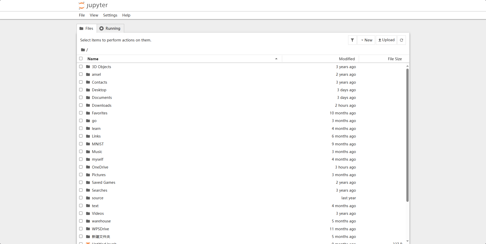

# 第一次内训：环境配置与 python 基础

!!! tip "tips"
	该文档主要讲解 git 版本控制，使用 Conda 进行环境管理以及 python 基础。
	
	学习过程中有任何问题请及时联系我们！！！

## GIT 

GIT 是什么？

- Git 是一个免费的开源分布式版本控制系统，旨在快速高效地处理从小型到大型的所有项目，作者 [Linus Torvalds](https://en.wikipedia.org/wiki/Linus_Torvalds)。

如何理解分布式版本控制系统（DVCS，Distributed Version Control System）？

- 分布式：去中心化，不需要联网，在本地就可以使用的代码仓库
- 版本控制：记录、管理、回溯文件的修改历史
- 基于内容寻址的存储系统（vs基于文件）

### 安装 GIT

参考[Install GIT](https://www.atlassian.com/zh/git/tutorials/install-git)

###基础命令

#### 创建本地版本库

```bash
git init 		# 使当前文件夹成为 git 仓库，并创建 .git 隐藏文件夹
git init <folder>		# 创建文件夹并使其成为 git 仓库
```

!!! warning "warning"
	请不要随意更改  `.git`文件夹中的内容！！！

#### 暂存区修改和提交

```bash
git add <filename>			# 提交修改的文件
git add .				    # 提交所有修改

git commit -m "message"		# 编辑提交信息，记录更改内容，便于回溯
```

#### 使用分支(branch)

- 创建与删除分支

  ```bash
  git branch <branchname>			# 基于当前 HEAD 创建
  git branch <branchname> id		# 基于 id 创建
  git branch -d <branchname>		# 删除某一分支
  ```

- 查看分支

  ```bash
  git branch			# -a 查看远程分支  -v 显示当前分支信息
  ```

- 内容比较

  ```bash
  git diff <branch1> <branch2>			# 比较两个不同分支
  git diff <branch>						# 比较工作区与分支
  git diff 								# 比较工作区与暂存区
  ```

- 合并

  ```bash
  git merge <branch1> <branch2> ...			# 将多个分区合并到当前分区
  ```

#### 忽略特殊文件

`.gitinnore`规定了 git 会忽略一些文件，语法如下

- \# 开头的行为注释
- \* 通配多个字符，`**` 通配中间目录（有或无  --eg： *.c 匹配所有 C 文件，a/**/b 匹配 a/b、a/x/b、a/x/y/b 等
- / 开头只匹配根目录，否则匹配所有目录
- ! 取消忽略

### 远程版本库

#### GIT SSH

可以使用如下命令获取 SSH 密钥

```bash
ssh-keygen -t ed25519 -C "your_email@example.com" #推荐，更现代，密钥长度短

ssh-keygen -t rsa -C "your_email@example.com" #兼容性更强
```

生成后会在系统的用户文件夹下新建`.ssh` 文件夹，里面保存了生成的公钥(.pub)与私钥(无后缀)。

!!! warning "warning"
	请不要让任何人知道你的私钥！！！

#### 在托管平台上绑定SSH

在用户设置中的SSH密钥中添加自己的公钥即可。

#### 常用

- 测试连接

  ```bash
  ssh -T git@github.com
  ```

- 添加或者删除远程仓库

  ```bash
  git remote add origin <repo>			# 添加
  git remote remove origin				# 删除
  git remote -v							# 查看
  ```

!!! tip "tips"
  	远程仓库名`origin`可以更换为你喜欢的名字。

- pull 和 push

  ```bash
  git pull <remote>    		#拉取远程版本
  git push <remote> <branch>    #上传远程存储库
  ```

## Conda 环境管理

Conda是一个开源的包管理系统和环境管理系统，核心功能是包管理与环境管理。通过Conda,用户
可以轻松安装和管理多个版本的Python以及相关的软件包。

Miniconda 则是 Conda 的轻量化版本——它只包含最基本的 python 解释器与 Conda 包管理器，以及一些必须的依赖项，后续内容均基于 Miniconda 展开。

### 安装 Miniconda

=== "Windows Command Prompt"
    ```bash
    curl https://repo.anaconda.com/miniconda/Miniconda3-latest-Windows-x86_64.exe -o .\miniconda.exe
    start /wait "" .\miniconda.exe /S
    del .\miniconda.exe
    ```
=== "Windows PowerShell"
    ```bash
    wget "https://repo.anaconda.com/miniconda/Miniconda3-latest-Windows-x86_64.exe" -outfile ".\miniconda.exe"
    Start-Process -FilePath ".\miniconda.exe" -ArgumentList "/S" -Wait
    del .\miniconda.exe
    ```
=== "MacOS" 
    === "arm64"
        ```bash
        mkdir -p ~/miniconda3
        curl https://repo.anaconda.com/miniconda/Miniconda3-latest-MacOSX-arm64.sh -o ~/miniconda3/miniconda.sh
        bash ~/miniconda3/miniconda.sh -b -u -p ~/miniconda3
        rm ~/miniconda3/miniconda.sh
        ```
    === "x86"
        ```bash
        mkdir -p ~/miniconda3
        curl https://repo.anaconda.com/miniconda/Miniconda3-latest-MacOSX-x86_64.sh -o ~/miniconda3/miniconda.sh
        bash ~/miniconda3/miniconda.sh -b -u -p ~/miniconda3
        rm ~/miniconda3/miniconda.sh
        ```
    然后刷新并初始化conda
    ```bash
    source ~/miniconda3/bin/activate
    conda init --all
    ```

!!! tip "tips"
    如果下载缓慢，可尝试国内镜像，比如[清华大学开源软件镜像站](https://mirrors.tuna.tsinghua.edu.cn/anaconda/miniconda/)，或者[浙江大学开源镜像站](https://mirrors.zju.edu.cn/anaconda/miniconda/)

### Conda 基础命令

- 创建并激活环境：

```bash
# 你可以指定其他的 python 版本
conda create --name <envname> python=3.9 -y

# 激活环境
conda activate <envname>

# 退出当前环境
conda deactivate
```

- 安装 python 包

```bash
conda install <package>==<version>

# 也可以使用 pip
pip install <package>==<version>
```

??? success "conda install 与 pip install 有什么区别？"
    详见[What is the difference between pip and Conda?](https://stackoverflow.com/questions/20994716/what-is-the-difference-between-pip-and-conda)
    

### Jupyter Notebook

Jupyter Notebook 是最新的基于 Web 的交互式开发环境，适用于笔记本、代码和数据。

#### 安装 Jupyter Notebook

你可以在 Anaconda Prompt 中运行以下命令来安装 Jupyter Notebook。

```bash
conda install jupyter notebook -y
```

运行 Jupyter Notebook：

```bash
jupyter notebook
```

成功运行后会自动跳转到如下图所示的 web 界面：



!!! tip "tips"
    如果自动跳转失败，则可以在浏览器输入`localhost:8888`实现手动跳转

#### 使用 Jupyter Notebook

在 web 界面点击右上角 New → 选择 Python 3，会生成一个扩展名为 .ipynb 的笔记本文件。

接下来你便可以尝试在 code 单元格输入 Python 代码，点击工具栏的 Run 按钮便可以运行当前单元格。

使用快捷键 `shift + Enter` 便可以运行当前单元格并跳转到下一个单元格。

### 在 IDE/编辑器 中使用

以 Windows 系统为例

=== "VS Code"
    - conda 虚拟环境：

      Search -> Show and Run Commands('>') -> Python: Select interpreter -> 选择现有的 conda 环境

    - Jupyter Notebook：

      新建文件时将文件后缀名改为`.ipynb`即可

=== "PyCharm"
    - conda 虚拟环境：

      右下角 python -> Add New Interpreter -> 找到 conda 根目录 -> envs -> <envname> -> python.exe

    - Jupyter Notebook：

      新建文件 -> 选择 Jupyter Notebook

## Python 基础

!!! tip "tips"
    我们非常推荐大家阅读[廖雪峰的 Python 教程](https://liaoxuefeng.com/books/python/introduction/index.html)

### Python 中的数据类型

- 整数：十进制，十六进制(0x前缀)等等，Python 还允许用`_`将数字分隔开来，比如`1000000`可以写作`1_000_000`，十六进制也是如此。

- 浮点数：即小数，可以使用科学计数法来表述，eg:`3.14e-10`表示 $3.14 \times 10^{-10}$。

- 字符串：单引号`'`或者双引号`"`内的内容，可以使用转义字符`\`来标识字符串内部可能出现的`'`以及`"`。

- Bool值：只有`True` or `False`。可以通过`and`，`or`以及`not`来进行运算。

- 空值：`None`.

- list：list是一种有序的集合，可以随时添加和删除其中的元素。list 中的元素的数据类型也可以不同，甚至可以是另一个 list。

- tuple：和 list 非常类似，但是必须初始化且初始化之后就不能更改。

- dict：使用键-值（key-value）存储，具有极快的查找速度。

- set：set和dict类似，也是一组key的集合，但不存储value，并且key不能重复。

??? success "Python 中的类型注解"
    Python 是一种 **动态语言** ，变量本身类型并不固定，即变量`a`在上一行可能是整数类型，到了下一行就有可能变成了字符串或是浮点数。不但容易发生类型错误，还不利用代码的理解。
    
    因此 Python 引入了类型注解这一概念，如下所示：
    ```Python
    name: str = 'Alice'
    ```
    不过需要注意的是，类型注解并不等于类型声明，只是为了能让人 or IDE 更好懂你的代码，Python 解释器是不会强制检查你的类型，比如：
    ```Python
    name: str = 10086
    print(name)
    ```
    是可以正常运行的，如果你想要避免这样的问题，可以打开类型检查器。
    
    更多内容可以查看这个视频[为什么越来越多Python项目都在写类型注解？](https://www.bilibili.com/video/BV1sW81zbEkD/?share_source=copy_web&vd_source=397c57b1ef8dc41f7432f7c6eafc3cde)

### 条件语句以及模式匹配

- if - else

```Python
if <条件判断1>:
    <执行1>
elif <条件判断2>:
    <执行2>
elif <条件判断3>:
    <执行3>
else:
    <执行4>
```

- match()

```Python
match 变量:
    case 模式1:
        # 当变量匹配模式1时执行
    case 模式2:
        # 当变量匹配模式2时执行
    case _:
        # 当所有模式都不匹配时执行（相当于默认分支）
```

### 循环

- for 循环

```Python
for x in ...
    <对每个 x 执行>
```

- while 循环

```Python
while <条件>
    <执行>
```

### 函数

可通过如下形式定义函数

```Python
def <函数命>(<变量>)
    <函数内容>
```

## 参考资料

- [廖雪峰的官方网站](https://liaoxuefeng.com)
- [ATLASSIAN GIT](https://www.atlassian.com/zh/git)
- [ANACONDA Getting Started](https://www.anaconda.com/docs/getting-started/getting-started)
- [Jupyter Notebook](https://jupyter.org)
- [菜鸟教程](https://www.runoob.com/python3/python3-tutorial.html)


