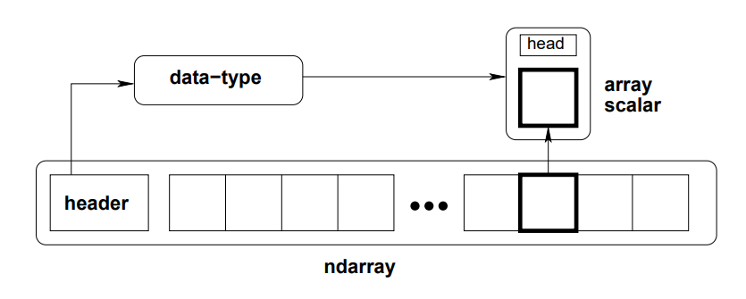
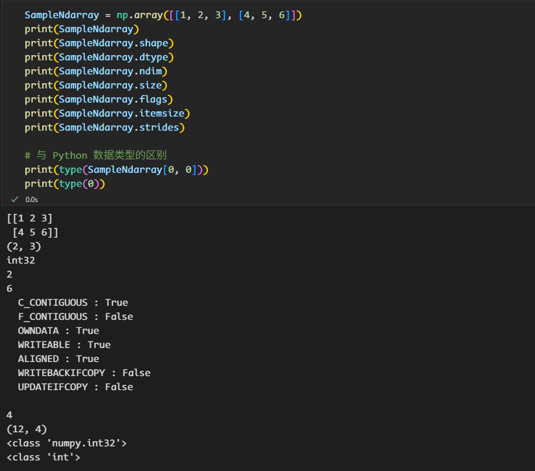

# Numpy 基础

[NumPy](https://numpy.org) 是 Python 语言的一个扩展程序库，支持大量的维度数组与矩阵运算。提供多维数组对象，各种派生对象（如掩码数组和矩阵），以及用于数组快速操作的各种 API，有包括数学、逻辑、形状操作、排序、选择、输入输出、离散傅立叶变换、基本线性代数，基本统计运算和随机模拟等等。

## 安装 NumPy

=== "pip"
    ```bash
    pip install numpy==<version>
    
    # 下载过慢可以考虑国内镜像
    # 清华镜像
    pip install numpy -i https://mirrors.tuna.tsinghua.edu.cn/pypi/web/simple

    # ZJU镜像
    pip install numpy -i https://mirrors.zju.edu.cn/pypi/web/simple
    ```

=== "conda"
    ```bash
    conda install numpy
    ```

!!! tip "tips"
    我们建议在虚拟环境下下载 NumPy 等本课程所需的 Pypi 。

NumPy 是 Python 科学计算生态系统的基石，其核心数据结构是 ndarray（N-dimensional array），即N维数组对象。

## ndarray

可以使用一下命令来创建 NumPy 数组。

```python
import numpy as np

np.array()

# 全 0 数组
np.zeros(shape=shape, dtype=dtype, order='C')           # 行优先

# 未初始化的数组
np.empty(shape=shape, dtype=dtype, order='F')           # 列优先
```



### 关键属性

- Data Block(数据块)： 一块连续的内存区域，用于存储数组的实际数据。

- Metadata(元数据)：描述数组的额外信息。

    - `ndarray.shape`：tuple，表示数组的大小。

    - `ndarray.dtype`：元素数据类型。

    - `ndarray.ndim`：维度。

    - `ndarray.size`：数组中元素个数。

    - `ndarray.flags`：内存的布局信息等。

    - `ndarray.itemsize`：元素所占字节数。

    - `ndarray.strides`：tuple，储存跨度信息，描述了在内存中为了移动到下一个元素，在每个维度上需要移动的字节数，是 NumPy 数组高性能的原因之一。



## 索引和切片

### 基础索引

Numpy 数组可以基于下标进行索引，切片对象可以通过内置的 slice 函数，并设置 start, stop 及 step 参数进行，从原数组中切割出一个新数组。

```python
SampleNdarray = numpy.array([[1, 2, 3], [4, 5, 6]])

print(SampleNdarray[0])
# 输出 [1 2 3]
print(SampleNdarray[0, 0])
# 输出 1
print(SampleNdarray[0, :])
# 输出 [1 2 3]
print(SampleNdarray[:, 0])
# 输出 [1 4]
print(SampleNdarray[0:2, 0:2])
# 输出 [[1 2], 
#       [4 5]]
print(SampleNdarray[:, 0::2])
# 输出 [[1 3],
#       [4 6]]
```

!!! tip "深拷贝与浅拷贝"
    

### 高级索引

- 整数数组索引：

    ```python
    x = numpy.array([[1,  2],  [3,  4],  [5,  6]]) 
    y = x[[0,1,2],  [0,1,0]] # [1 4 5]
    ```

- 布尔索引

    ```python
    x = numpy.array([[1,  2],  [3,  4],  [5,  6]])
    y = x[x > 4] # [5 6]
    ```

### 广播机制(Broadcast)

- 让所有输入数组都向其中形状最长的数组看齐，形状中不足的部分都通过在前面加 1 补齐。

- 输出数组的形状是输入数组形状的各个维度上的最大值。

- 如果输入数组的某个维度和输出数组的对应维度的长度相同或者其长度为 1 时，这个数组能够用来计算，否则出错。

- 当输入数组的某个维度的长度为 1 时，沿着此维度运算时都用此维度上的第一组值。

举个栗子

```python
import numpy as np 
 
a = np.array([[ 0, 0, 0],
           [10,10,10],
           [20,20,20],
           [30,30,30]])
b = np.array([0,1,2])
print(a + b)
```

??? success "提升自己的水品"
    [Numpy100](https://github.com/rougier/numpy-100)

## 参考资料

- [Guide to NumPy](https://web.mit.edu/dvp/Public/numpybook.pdf)
- [菜鸟教程](https://www.runoob.com/numpy/numpy-tutorial.html)