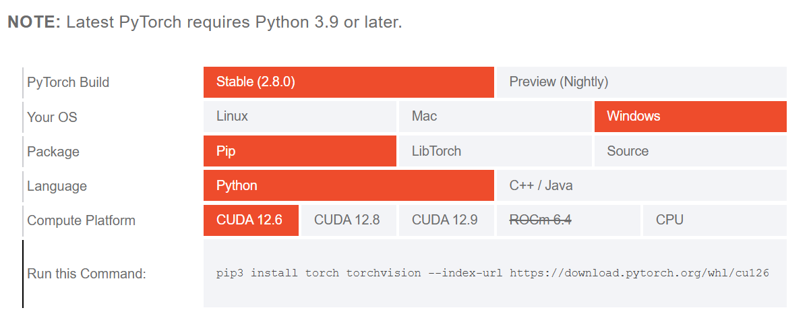
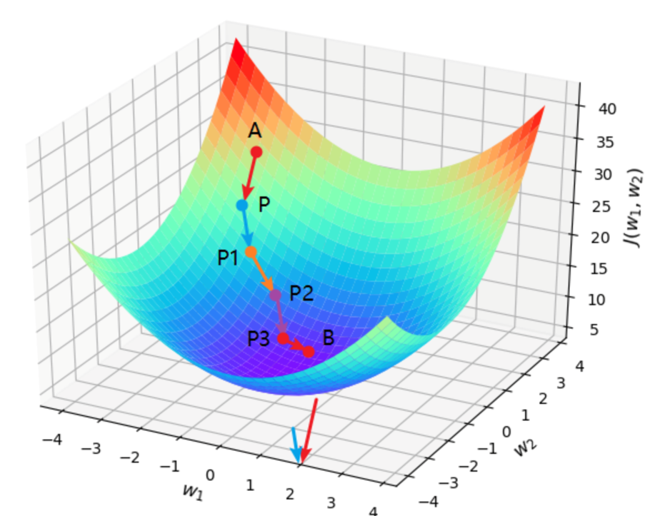

# 神经网络基础原理

## 环境配置

下载 Pytorch ：

访问 [Pytorch](https://pytorch.org/get-started/locally)，按照官网上的要求来下载相应版本的 Pytorch ，如下图所示。



在命令行中输入相应的命令即可。

!!! tip "如何查看 cuda 版本"
    在命令行输入
    ```bash
    nvidia-smi
    ```
    即可查看对应的 cuda 版本。
    有 gpu 才能用 cuda ，没有的用 cpu 版本的 Pytorch。

## 知识讲解

### 损失函数

**损失函数** 能够量化目标的实际值与预测值之间的差距。通常我们会选择非负数作为损失，且数值越小表示损失越小，完美预测时的损失为0。回归问题中最常用的损失函数是平方误差函数：

$$l_i(\mathbf{w}, b) = \frac{1}{2} \left(\hat{y}_i - y_i\right)^2.$$

为了衡量模型在整个数据级上的拟合质量，我们常需计算在训练集 $\mathbf{n}$ 个样本上的均值损失，即：

$$L(\mathbf{w}, b) = \frac{1}{n}\sum_{i=1}^n l^{(i)}(\mathbf{w}, b) = \frac{1}{n} \sum_{i=1}^n \frac{1}{2}\left(\mathbf{w}^\top \mathbf{x}^{(i)} + b - y^{(i)}\right)^2.$$

### 梯度下降

梯度下降(gradient descent)是通过不断地在损失函数递减的方向上更新参数来降低误差。

{width=80%}

??? success "举个例子"
    对于一个线性回归模型，假设包含 $\mathbf{d}$ 个特征，那么预测结果 $\hat{\mathbf{y}}$ 可以表示为

    $$\hat{y} = w_1  x_1 + ... + w_d  x_d + b$$

    使用线性代数的方法表示就是

    $$\hat{y} = \mathbf{w}^\top \mathbf{x} + b$$

    其中 $\mathbf{x} \in \mathbb{R}^d$ ，$\mathbf{w} \in \mathbb{R}^d$ 。

    假设数据集中包含 $\mathbf{n}$ 个样本，

    $${\hat{\mathbf{y}}} = \mathbf{X} \mathbf{w} + b$$

    其中特征集合 $\mathbf{X} \in \mathbb{R}^{n \times d}$ ，预测值 $\hat{\mathbf{y}} \in \mathbb{R}^n$ 。

    计算损失函数

    $$L(\mathbf{w}, b) =\frac{1}{n}\sum_{i=1}^n l_{i}(\mathbf{w}, b) =\frac{1}{n} \sum_{i=1}^n \frac{1}{2}\left(\mathbf{w}^\top \mathbf{x}_{i} + b - y_{i}\right)^2$$

    可以发现，损失函数 $L(\mathbf{w}, b)$ 是一个关于系数 $\mathbf{w}$ 和偏置 $b$ 的函数。

    我们可以通过计算损失函数（数据集中所有样本的损失均值） 关于模型参数的导数（梯度）来实现梯度下降。但实际的执行可能会非常慢：因为在每一次更新参数之前，我们必须遍历整个数据集。

    因此，我们通常会在每次需要计算更新的时候随机抽取一小批样本， 这种变体叫做小批量随机梯度下降（minibatch stochastic gradient descent）。

    更新过程可以用如下数学公式表示：

    $$(\mathbf{w},b) \leftarrow (\mathbf{w},b) - \frac{\eta}{|\mathcal{B}|} \sum_{i \in \mathcal{B}} \partial_{(\mathbf{w},b)} l_{i}(\mathbf{w},b).$$

### softmax 回归

softmax 是一种常用的激活函数，主要用于多分类问题，其核心作用是将一组任意范围的实数转换为符合概率分布的数值，以便直观地表示 “属于某个类别的可能性”。

以一个简单的三分类为例，如下图所示


$$\begin{split}\begin{aligned}
o_1 &= x_1 w_{11} + x_2 w_{12} + x_3 w_{13} + x_4 w_{14} + b_1,\\
o_2 &= x_1 w_{21} + x_2 w_{22} + x_3 w_{23} + x_4 w_{24} + b_2,\\
o_3 &= x_1 w_{31} + x_2 w_{32} + x_3 w_{33} + x_4 w_{34} + b_3.
\end{aligned}\end{split}$$

softmax 的计算公式为：

$$\hat{y}_j = \frac{\exp(o_j)}{\sum_k \exp(o_k)}$$


### 多层感知机

## 参考资料

- [Pytorch Learn](https://pytorch.org/get-started/locally/)

- [动手学深度学习 Pytorch 版](https://zh.d2l.ai)