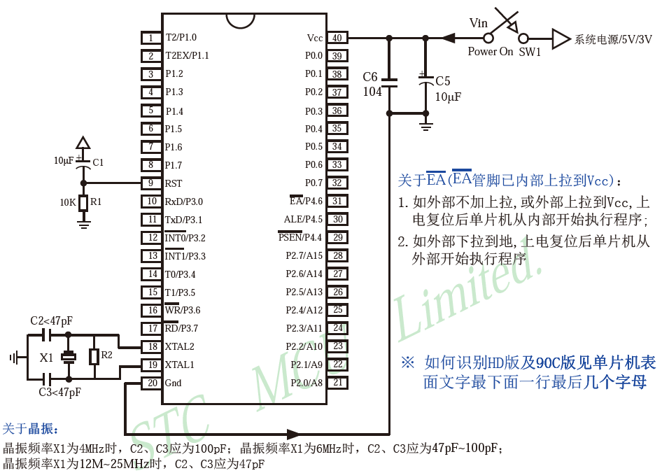
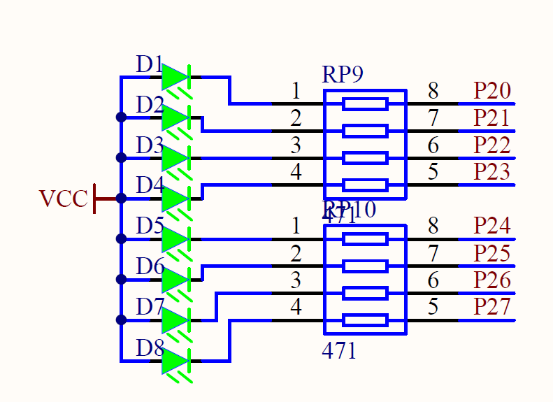

# c51

单片机，Micro Controller Unit

| 单片机型号 | 51单片机 |
| :--------: | :------: |
|    公司    | STC公司  |
|    位数    |    8     |
|    RAM     | 512字节  |
|    ROM     |    8k    |
|  工作频率  |  12MHz   |



## LED(Light Emitting Diode)

### 原理



VCC 部分接入高电平，想要使相应位置的LED亮起，则需要使 P20 ~ P27 接口处为低电平，这部分对应 P2 寄存器，即需要通过操作寄存器实现 LED 的亮起。

当 P20 == 1 时，P20 处为高电平。

####点亮LED

```c
#include <REGX52.h>

int main(void)
{
    P2 = 0xfe // 1111 1110 依次对应P27 ~ P20
    
    return 0;
}
```

####利用位运算实现流水灯的实现

```c
#include <REGX52.h>

int main(void)
{	
	unsigned char theLight = 0x01;
	while(1)
	{
		P2 = 0xff ^ theLight;
		theLight = (theLight << 1) | (theLight >> 7);
		Delay(100);
	}
}
```

#### 使用独立案件控制 LED 的亮灭

##### 灯移位

```c
#include <REGX52.h>
#include <INTRINS.H>

void Delay20ms(void)	//@11.0592MHz
{
	unsigned char data i, j;

	i = 216;
	j = 37;
	do
	{
		while (--j);
	} while (--i);
}


int main(void)
{	
	unsigned char theLight = 0x01;
	P2 = 0xff ^ theLight;
	while(1)
	{
		if (P3_1 == 0)
		{
			Delay20ms();
			while(1)
			{
				if (P3_1 == 1)
					break;
			}
			Delay20ms();
			theLight = (theLight << 1) | (theLight >> 7);
			P2 = 0xff ^ theLight;
		}
		
		if (P3_0 == 0)
		{
			theLight = (theLight >> 1) | (theLight << 7);
			P2 = 0xff ^ theLight;
			Delay20ms();
			while(1){
				if (P3_0 == 1){
					break;
				}
			}
		}
	}
}
```


