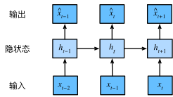

# Fundamental

## 序列模型

序列模型（Sequence Model）是一类专门处理“有顺序关系的数据”的模型。它关注的数据不是独立同分布的，而是元素之间存在时间或位置依赖。

### 自回归模型

输入数据的数量是主要问题，它会随着遇到的数据量增加而增加，因此需要找到一个近似方法来使这个计算变得容易处理。

- **策略一：自回归模型（autoregressive models）**：

    在现实中，序列 $x_{t-1}, \ldots, x_1$ 相当长的一部分是不需要的，因此我们可以取某个长度为 $\tau$ 的跨度，即 $x_{t-1}, \ldots, x_{\tau}$ 。最直接的好处就是参数的数量总是不变的， 至少在 $t > \tau$ 时如此，这就使我们能够训练一个上面提及的深度网络。

- **策略二：隐变量自回归模型（latent autoregressive models）**：
    
    保留一些对过去的观测 $h_t$ ，实时更新预测 $\hat{x}_t$ 和总结 $h_t$ ，这就产生了基于 $\hat{x}_t = P(x_t \mid h_{t})$ 估计 $\hat{x}_t$ ，以及公式 $h_t = g(h_{t-1}, x_{t-1})$

    

### 马尔可夫模型

### 因果关系

