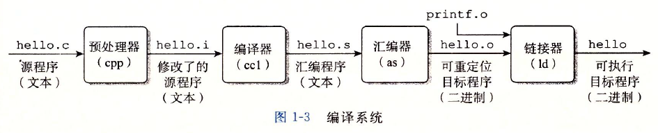
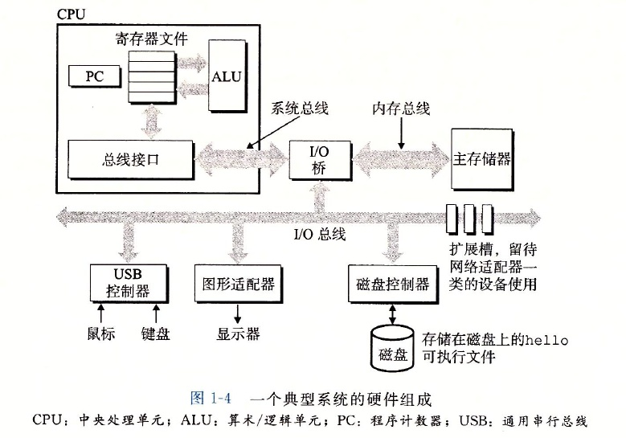
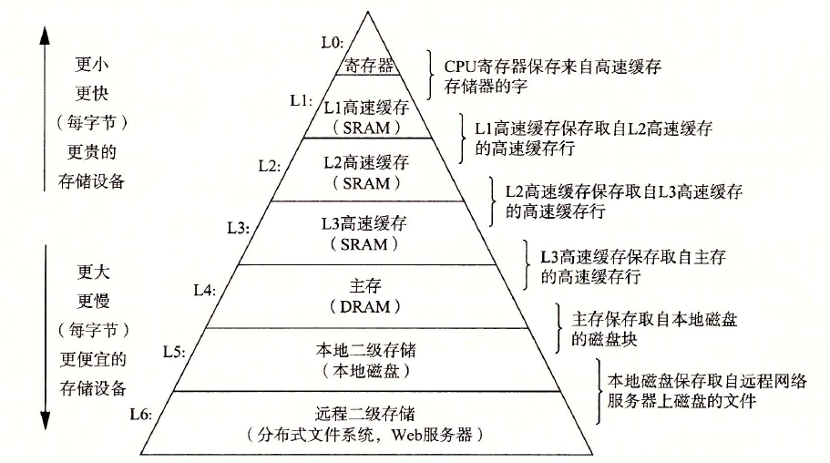
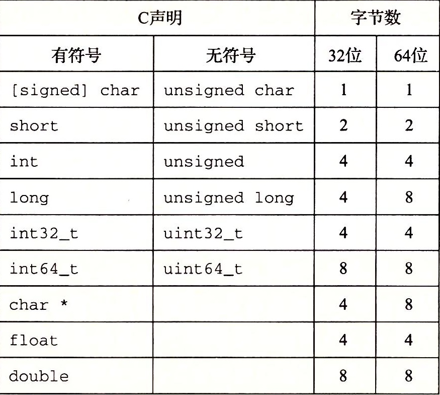

# OS

## 漫游

### 编译过程



- **预处理阶段**：预处理器读取头文件（即以`#`开头的命令）中的内容，并把其插入到程序文本中。
- **编译阶段**：将.i文件翻译为.s文件，它包含一个汇编语言的程序。
- **汇编阶段**：汇编器将将.s文件翻译为机器语言指令，把这些指令打包成一种叫做 relocatable object program （可重定位目标程序）的格式，并保存在.o文件中。
- **连接阶段**：hello 程序调用了`printf`函数，但是只提供了声明，并没有提供定义，可以在预编译好了的printf.o 文件中找到，通过连接器合并，便得到了可执行文件。

### 硬件



- **总线**：携带信息字节并负责在各个部件中传递。
- **I/O 设备**：输入/输出设备，是系统与外界沟通的桥梁。
- **主存**：一个临时储存设备，用来存放程序和程序处理的数据。
- **处理器（CPU）**：中央处理单元，解释或执行指令的引擎，核心是寄存器。



## 程序的结构和运行

### 数据



#### 寻址和字节顺序

假设一个变量`x`，地址在`0x100`：

```c
int x = 0x012345678
```

- **大端序**：最高有效字节在最前面。
- **小端法**：最低有效字节在最前面。


P66


